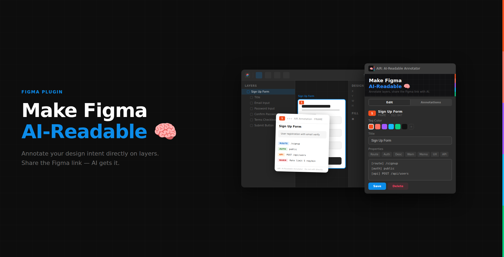
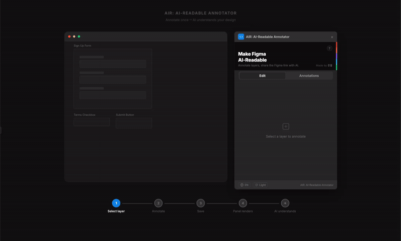

<p align="center">
  
</p>

<h1 align="center">AIR: AI-Readable Annotator</h1>

<p align="center">
  <strong>Make your Figma designs AI-readable.</strong><br/>
  Annotate layers with structured properties — share the Figma link, and AI understands your UI.
</p>

<p align="center">
  <a href="https://www.figma.com/community/plugin/1607082470277129320">Install from Figma Community</a>
</p>

---

## The Problem

When AI reads your Figma file, it sees this:

```
FRAME "Frame 48"
  ├ FRAME "Frame 12"
  ├ FRAME "Frame 13"
  ├ INSTANCE "Frame 14"
  ├ RECTANGLE "Rectangle 7"
  └ ... 43 more layers
```

No routes, no auth rules, no API endpoints, no business logic. Just unnamed frames and rectangles.

**AIR fixes this.** Annotate once, and AI understands your design intent.

## How It Works

### 1. Select a layer

Pick any layer on your Figma canvas and open the AIR plugin.

<p align="center">
  
</p>

### 2. Annotate with structured properties

Write annotations using simple tags: `[route]`, `[auth]`, `[api]`, `[ux]`, `[warn]`, `[memo]`, `[desc]`.

<p align="center">
  
</p>

### 3. Save

Hit Save. A clean annotation panel renders right next to your design.

<p align="center">
  
</p>

### 4. Panel renders on canvas

A visual card with color-coded tags, a numbered marker badge, and hidden data for AI to read.

<p align="center">
  
</p>

### 5. AI understands

Share the Figma link with any AI tool. It reads your annotations and generates code with full context.

<p align="center">
  
</p>

## Demo

<p align="center">
  
</p>

## Features

| Feature | Description |
|---------|-------------|
| **Structured Tags** | `[route]`, `[auth]`, `[api]`, `[ux]`, `[warn]`, `[memo]`, `[desc]` |
| **Visual Panels** | Color-coded annotation cards rendered on the canvas |
| **Marker Badges** | Numbered badges on annotated layers for quick identification |
| **AI Spec Index** | Auto-generated machine-readable index of all annotations |
| **Light & Dark Themes** | Toggle annotation panel themes to match your preference |
| **Bilingual UI** | Full English and Korean support |
| **Batch Annotate** | Annotate multiple layers at once |
| **Migration Safe** | Handles legacy "Spec" naming from previous versions |

## Tag Reference

```
[route] /signup              → Page route / URL
[auth]  public               → Authentication rule
[api]   POST /api/users      → API endpoint
[ux]    Must agree to terms   → UX requirement
[warn]  Rate limit 5 req/min → Warning / constraint
[memo]  Check with backend   → Internal note
[desc]  Sign up form         → General description
```

Tags are case-sensitive (lowercase only). Lines without a tag prefix become `[desc]` automatically.

## Development

### Prerequisites

- Node.js 18+
- [Figma desktop app](https://www.figma.com/downloads/)

### Setup

```bash
git clone https://github.com/lorenleedev/air-annotator.git
cd air-annotator
npm install
```

### Commands

```bash
npm run build      # Compile src/code.ts → code.js
npm run watch      # Rebuild on file changes
npm run typecheck  # Type check with tsc --noEmit
npm test           # Run test suite
```

### Load in Figma

1. Open Figma desktop app
2. Go to **Plugins** > **Development** > **Import plugin from manifest...**
3. Select the `manifest.json` file from this repo

### Project Structure

```
air-annotator/
├── src/
│   └── code.ts          # TypeScript source (main thread)
├── code.js              # Build output (do not edit)
├── ui.html              # Plugin UI (iframe, vanilla JS)
├── manifest.json        # Figma plugin manifest
├── esbuild.mjs          # Build script
├── tsconfig.json        # TypeScript config (strict)
├── test.js              # Test suite (no dependencies)
└── package.json
```

## License

All rights reserved. Copyright (c) 2026 은결.

## Author

Made by **은결**
